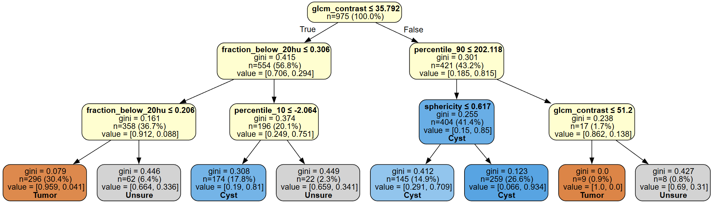
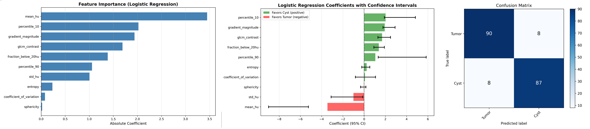

<h2 align="center"> Renal Vision </h2>
<h3 align="center"> Explainable Cyst vs Tumor Classification </h4>

<div align="center">
<a href="https://github.com/hhaentze/CystClassifier/actions/workflows/ci.yaml"></a>
<a href="https://github.com/hhaentze/CystClassifier/master/License.txt"></a>
<a href="https://github.com/psf/black"></a>
</div>




## Installation

```bash
pip install -e .

# for development
make install-dev
```
## Usage

TLDR: Check out our fully working [demo notebook](notebooks/demo.ipynb) to train a classifier on pre-extracted features from the KITS 23 dataset!

### Generate train/test split
```python
from cyst_classifier.data_utils import generate_train_test_split
import pandas as pd

df = pd.read_csv("data.csv")
train_idx, test_idx = generate_train_test_split(df, test_size=0.2, random_state=42)
df.iloc[train_idx].to_csv("train.csv", index=False)
df.iloc[test_idx].to_csv("test.csv", index=False)
```

### Pre-extract features (RECOMMENDED for fast experimentation)
```bash
# Extract features once (slow)
python -m cyst_classifier.extract_features --data train.csv --output features_train.csv
python -m cyst_classifier.extract_features --data test.csv --output features_test.csv

# Train on cached features (fast - seconds instead of hours!)
cyst_classifier train --data features_train.csv --model logistic --output-dir results --explain

# Evaluate on cached features (fast)
cyst_classifier eval --data features_test.csv --model results/model.pkl --output-dir results --explain
```

### Train a model (direct from images - slower)
```bash
cyst_classifier train --data train.csv --model logistic --output-dir results
```

### Inference on single lesion
```bash
cyst_classifier infer --image ct.nii.gz --seg mask.nii.gz --model model.pkl
```

### Inference on multi-lesion scan
```bash
cyst_classifier infer --image ct.nii.gz --seg mask.nii.gz --model model.pkl --multi-lesion --output result.nii.gz
```

### Evaluate model
```bash
# From cached features (fast)
cyst_classifier eval --data features_test.csv --model model.pkl --output-dir results/

# Or directly from images (slower)
cyst_classifier eval --data test.csv --model model.pkl --output-dir results/

# With uncertainty handling
cyst_classifier eval --data test.csv --model model.pkl --output-dir results/ --uncertainty-threshold 0.75

# Find optimal uncertainty threshold (validation set)
cyst_classifier eval --data val.csv --model model.pkl --output-dir results/ --find-threshold

# With explanations (includes uncertainty-aware explanations if threshold > 0.5)
cyst_classifier eval --data test.csv --model model.pkl --output-dir results/ --uncertainty-threshold 0.75 --explain
```

## Performance Tips

**For rapid experimentation**: Pre-extract features with `extract_features_script.py`
- Feature extraction: ~1-2 hours (one time)
- Model training: ~seconds (can repeat many times)
- Space efficient: ~72 bytes per lesion vs ~500KB for image data

**The main script auto-detects** whether you're using feature CSVs or image CSVs, so you can switch seamlessly!

## Data Format

Input CSV should have columns: `case`,`seg_path`, `image_path`

Segmentation labels:
- 1: Kidney (ignored)
- 2: Tumor (solid)
- 3: Cyst

## Features

The classifier uses the following radiomics features:
- Mean HU (intensity)
- Standard deviation HU
- Coefficient of variation (std/mean)
- 10th and 90th percentiles
- Entropy (histogram-based)
- GLCM contrast (texture)
- Mean gradient magnitude (edge characteristics)
- Sphericity (shape regularity)
- Fraction of voxels < 20 HU (fluid detection)

## Models

The following models are implemented at the moment.
- Logistic Regression `--model logistic`
- Shallow Tree `--model tree`


## Explainability

Running `cyst_classifier train` automatically creates an explainability folder inside the specified directory. Check it out to see which features were espacially important. If you set the `--explain` a comprehensive overview will be printed as well.
Neat: if you combine `--uncertainty-threshold X` and `--explain` during evaluation a new updated explainability section that takes uncertainty into account will be created!




## How to Contribute

To mantain hiqh quality code please adhere to our coding guidelines. You can run the full Continuous Integration pipeline locally. This ensures your code is clean, typed correctly, and fully tested.

  * **Run All Checks:**

    ```bash
    make ci
    ```

    This single command executes the workflow in the following order: **Linting** (Ruff/Black) $\rightarrow$ **Type Checking** (Mypy) $\rightarrow$ **Unit Tests & Coverage** (Pytest).

  * **Fix Code Style Automatically:**
    If the `make ci` command reports style or formatting errors, you can fix them instantly using:

    ```bash
    make format
    ```

Once your code is formatted correctly and passes `make ci` locally, push your changes and open a Pull Request. Our GitHub Actions pipeline will mirror your local `make ci` run and upload a final test coverage report.
