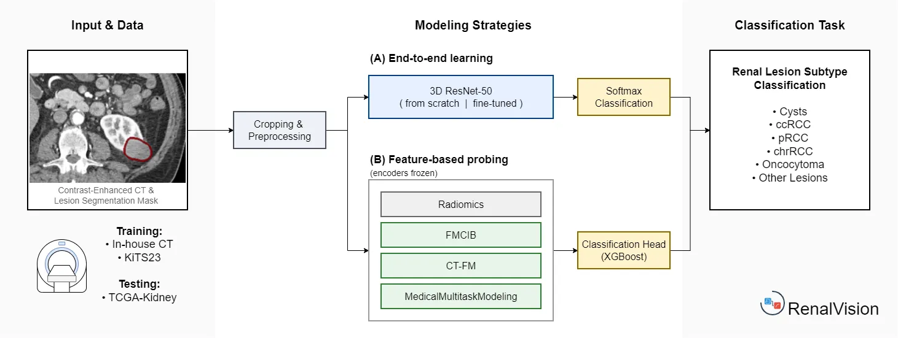

<h1 align="center">
  
  Renal Vision
</h1>

<h3 align="center">The Modular Lesion Analysis Platform</h3>


<div align="center">
<a href="https://github.com/hhaentze/CystClassifier/actions/workflows/ci.yaml"></a>
<a href="https://github.com/hhaentze/RenalVision/blob/main/License.txt"></a>
<a href="https://www.comfort-ai.eu/for-patients/kidney-cancer">
  </a>
<a href="https://github.com/astral-sh/ruff"></a>

</div>

RenalVision is a modular, high-performance platform for quantifying and classifying renal lesions. Its architecture is completely modality-agnostic, separating the [**Data Engine**](src/renal_vision/features) from the [**Machine Learning Logic**](src/renal_vision/modeling).

This platform allows researchers to decouple the heavy lifting of image processing (Radiomics, Neural Embeddings) from the rapid iteration of model training.



## 🌟 Core Features

* **Modular Architecture:** Explicit separation between Feature Extraction (`renal_vision/features`) and Model Training (`renal_vision/modeling`).
* **Offline Feature Store:** Converts heavy NIfTI/NRRD/MHA datasets into lightweight, efficient Parquet feature stores.
* **Self-Contained Models:** Trained models (`ModelBundle`) store their own preprocessing configuration, class mappings, and scaling logic, ensuring reproducible inference.
* **Robust Inference:** Classify single or multiple lesions in a scan at once without any additional configurations. `LesionPredictor` handles it for you.

## 🛠️ Installation
Clone the repo and install it yourself with the help of make. We recommend python 3.10. The base installation includes only the radiomics support. If you want to run additional modules please specify these as additional dependencies.
```bash
# Clone the repository
git clone https://github.com/hhaentze/RenalVision.git
cd RenalVision

# Install in editable mode
make install
# or for development
make install-dev

# Need more modules?
make install; pip install ".[fmcib, ctfm, mevis]"
# Alternatively
make install-all
```

## 📋 TLDR
Renal Vision comes with five pre-trained models that you can use from the get-go: `radiomics_binary`, `radiomics`, `mevis`, `fmcib`, and `ctfm`. Read more about inference in the [Bundles](src/renal_vision/bundles) section.

## 🚀 Quick Start (CLI)
The platform exposes a unified command-line interface: rv.

### 1. Extract Features (Data Engine)
Convert raw images and masks into a feature table. Mask values (excl. 0) are use to deduct class_id's that are assigned to the feature vectors.

**Important:**
* Indexing of classes in the segmentation masks starts at 1
* Indexing of classes in the extracted feature vectors starts at 0

```bash
rv extract \
    --data ./data/dataset.csv \
    --extractor radiomics \
    --output ./data/features/radiomics_v1.parquet
```
Or alternatively, use a foundation model:
```bash
rv extract \
    --data ./data/dataset.csv \
    --output ./data/features/embeddings_v1.parquet \
    --extractor ctfm \
    --augment 5
```
This will save a parquet file as well as a summary of the extraction configurations the specified path.

### 2. Train & Evaluate Model (Logic Engine)
Utilize the extracted features.

```bash
rv train \
    --data ./data/features/radiomics_v1.parquet \
    --extractor-config ./data/features/radiomics_v1.config.json \
    --model xgboost \
    --output-dir ./models/v1

rv eval \
    --data ./data/features/radiomics_v2.parquet \
    --model ./models/v1/model.pkl \
    --output-dir ./models/v1
```

### 3. Run Inference
Predict on new scans using the trained model bundle.

```bash
rv infer \
    --image ./new_data/scan_001.nii.gz \
    --seg ./new_data/mask_001.nii.gz \
    --model ./models/v1/model.pkl \
    --output ./results/prediction_001.nii.gz
```

To run our pretrained models simply set --model to either `radiomics_binary`, `radiomics`, `mevis`, `fmcib`, or `ctfm`

##

## 🐍 Python API
RenalVision is designed to be used programmatically for custom pipelines.

### Inference
```python
from renal_vision.modeling.inference import LesionPredictor

# 1. Initialize Predictor (Auto-loads extractor config from the model)
predictor = LesionPredictor(model_identifier="model.pkl")

# 2. Predict full mask (multi-lesion)
mask = predictor.infer_mask(
    image="scan.nii.gz",
    seg="full_mask.nii.gz",
    output_path="predictions.nii.gz"
)


# 3. Predict a single lesion
result = predictor.infer_lesion(image="scan.nii.gz", seg="lesion_mask.nii.gz")
print(result)
```
```json
{
  'class_id': 0,                    # predicted class
  'class_name': 'Tumor',            # predicted class name
  'confidence': 0.997,              # proability of predicted class
  'probability': [[0.997, 0.003]],  # proabilities of all classes
  'volume': 8726                    # volume of target lesions in mm^3
 }
```

### Preprocessing
If you want to build your own data loader consider using one of our prepocessors, which efficiently combine repeated augmentation and sampling of multiple annotated target regions.

```python
from renal_vision.features.preprocessing import CTPreprocessor

# initialise
preprocessor = CTPreprocessor()

# load image and mask with base augmentations
img, seg = preprocessor("img.nii","seg.nii", augment=False)

# load with n random augmentations
data_stream = preprocessor.stream_augmented("img.nii","seg.nii",n_augmentations = 5)
for img, seg, is_augmented in data_stream:
  # Do stuff

# crop on all individual lesions
component_stream = preprocessor.stream_components(img, seg,  min_volume = 400):
for lesion, lesion_mask, lesion_id, meta in component_stream:
  # Do stuff
```

## 🔌 Expandability
The platform is designed for extension.

### Adding New Feature Extractors:

1. Create a new class in `src/features/` inheriting from `BaseFeatureExtractor`.

2. Implement `_extract_single_lesion` (logic) and `get_config` (serialization).

3. Register it in the `_reconstruct_extractor factory` in `src/modeling/inference.py`.

### Adding New Models:

1. Add the architecture to `src/modeling/models.py` inside ModelFactory.

2. Update the `ModelType` enum.

### Adding Custom Preprocessing:

1. Create a `CustomPreprocessor` in `src/features/preprocessing.py` inheriting from `BasePreprocessor`.

2. Pass this preprocessor to your Extractor.


## 📝 How to Contribute

To mantain hiqh quality code please adhere to our coding guidelines. You can run the full Continuous Integration pipeline locally. This ensures your code is clean, typed correctly, and fully tested.

  * **Run All Checks:**

    ```bash
    make ci
    ```

    This single command executes the workflow in the following order: **Linting** (Ruff/Black) $\rightarrow$ **Type Checking** (Mypy) $\rightarrow$ **Unit Tests & Coverage** (Pytest).

  * **Fix Code Style Automatically:**
    If the `make ci` command reports style or formatting errors, you can fix them instantly using:

    ```bash
    make format
    ```

Once your code is formatted correctly and passes `make ci` locally, push your changes and open a Pull Request. Our GitHub Actions pipeline will mirror your local `make ci` run and upload a final test coverage report.
