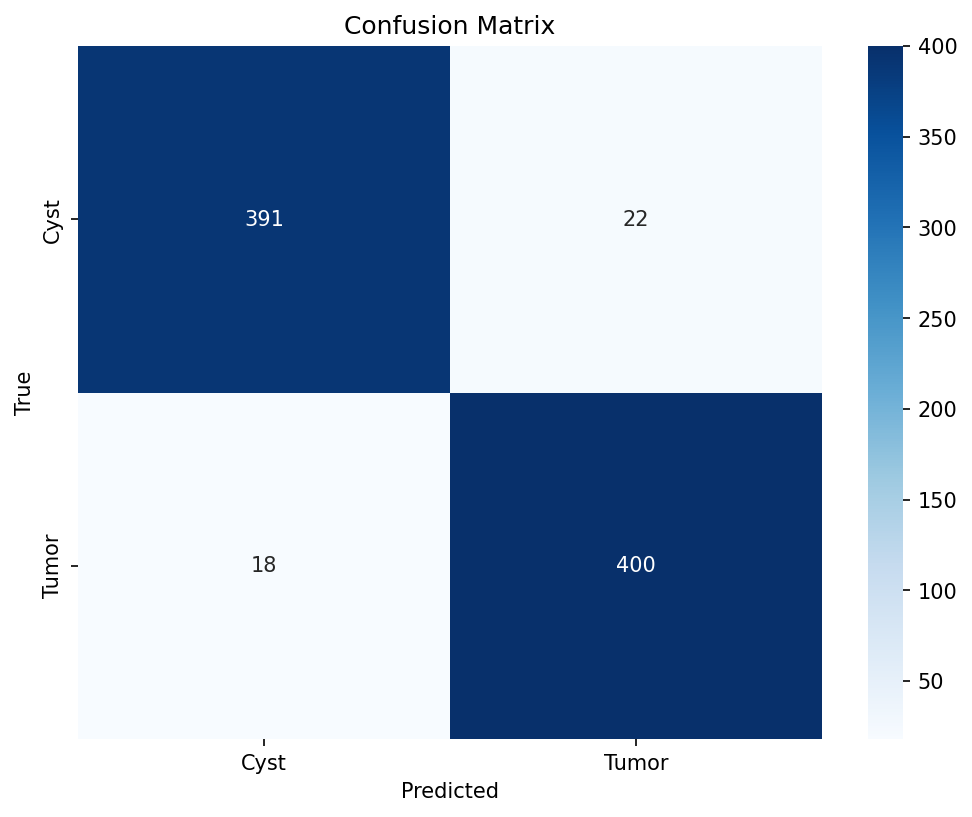
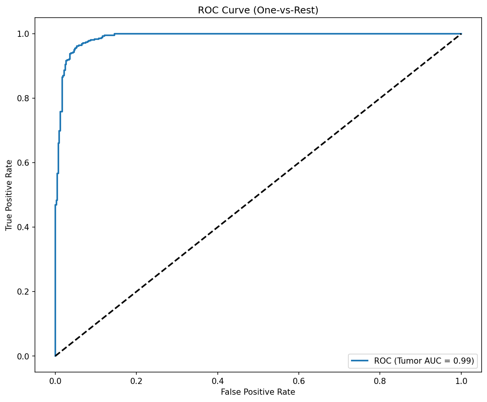
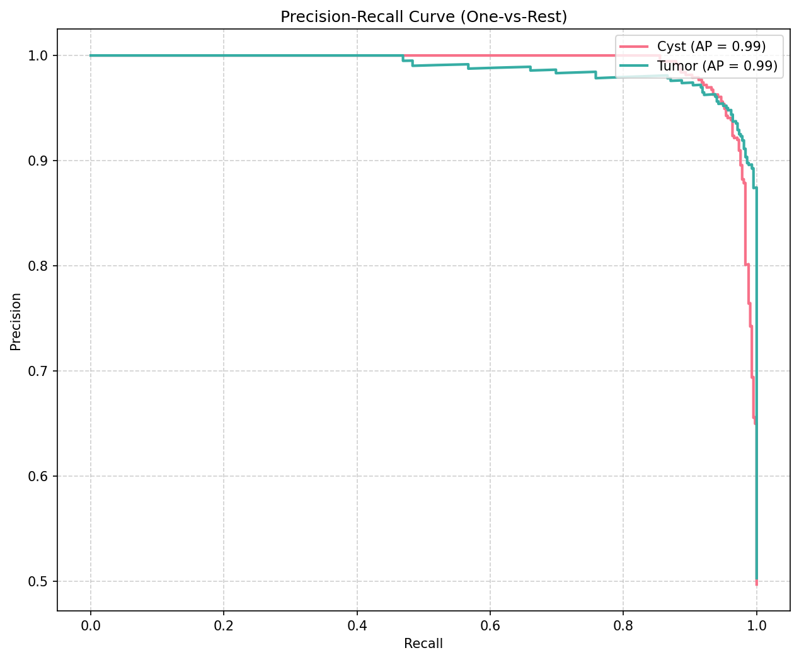
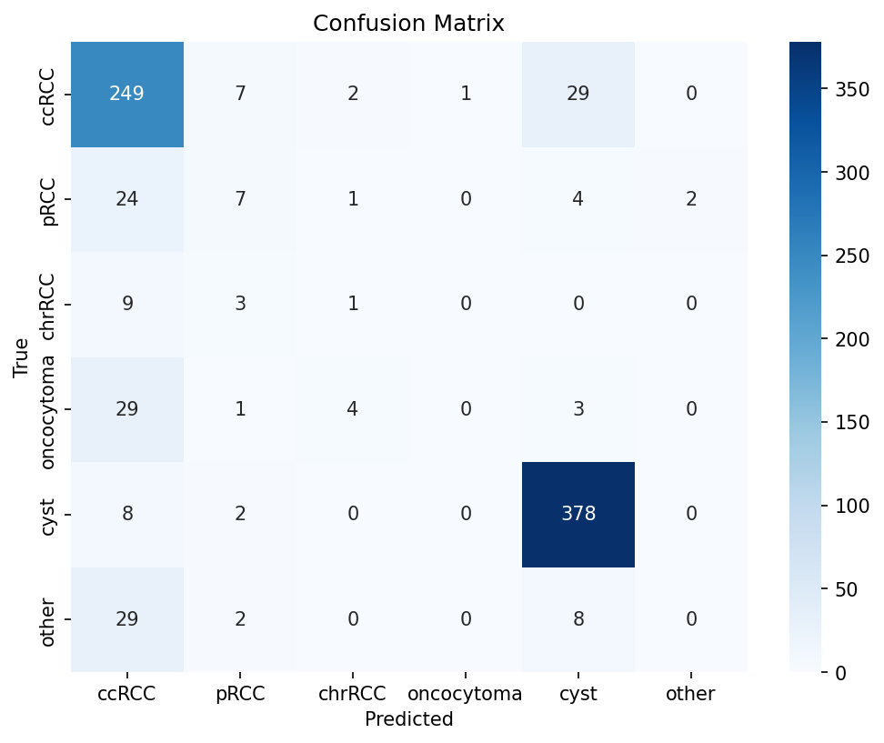
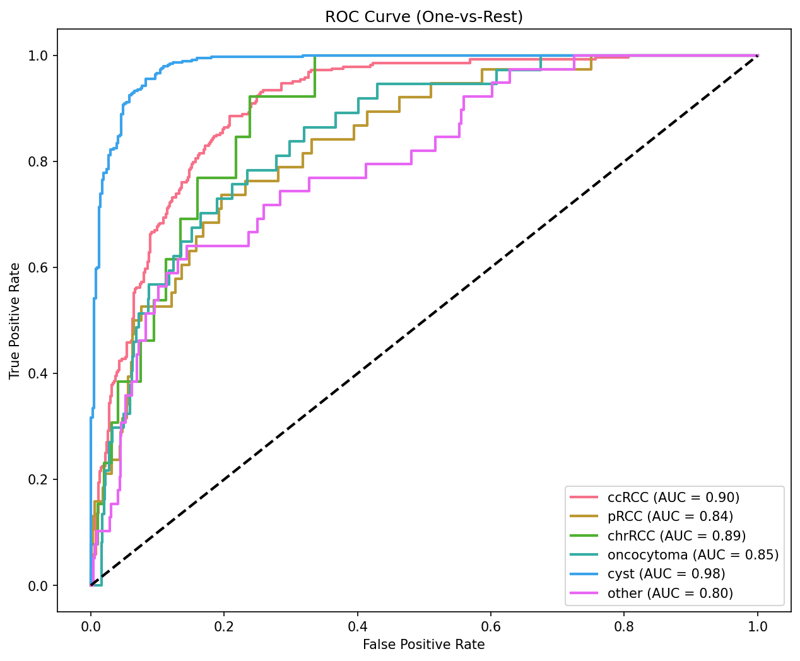
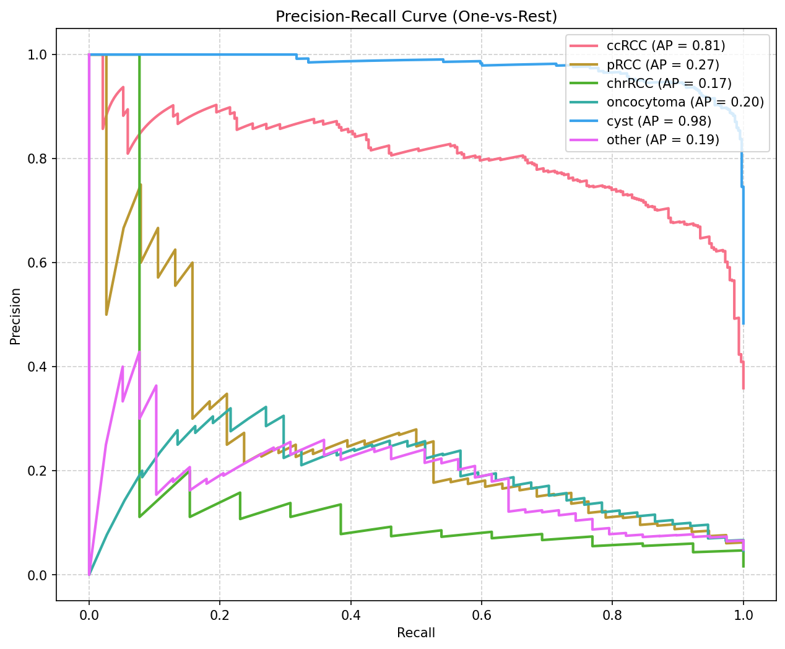

# Renal Vision - Pretrained Bundles

We trained these models on scans from both Charité and KiTS.
In total 4315 lesions were extracted from 1309 patients.

You can use them either in the CLI:
```bash
rv infer
```

or with our python API:
```python
from renal_vision.modeling.inference import LesionPredictor
from renal_vision.bundles import ImplementedModels

# Either use our enum class
predictor1 = LesionPredictor(model_identifier=ImplementedModels.HISTOLOGY_SUBTYPE)

# Or just pass the string directly
predictor2 =  LesionPredictor(model_identifier="TUMOR_CYST")
```


### 1. Radiomics based Tumor/Cyst classifier
- identifier: **TUMOR_CYST**
- xgboost model
- trained on KiTS & Charité (80%)
- validated on KiTS & Charité (20%)
* F1: 0.95

Classes:
```python
{
    0: "Tumor",
    1: "Cyst",
}
```


<div align="center">
  
  
  
</div>

### 2 Radiomics based histology-subtype classifier
- identifier: **HISTOLOGY_SUBTYPE**
- xgboost model
- trained on KiTS & Charité (80%)
- validated on KiTS & Charité (20%)
* F1: 0.74

Classes:
```python
{
    0: "ccRCC",
    1: "pRCC",
    2: "chrRCC",
    3: "Oncocytoma",
    4: "Cyst",
    5: "Other",
}
```

<div align="center">
  
  
  
</div>
